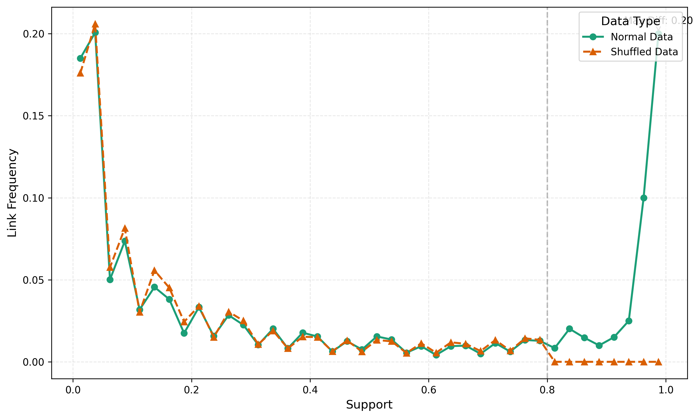

# Network Bootstrap FDR & mini GeneSPIDER

A Python implementation of NB-FDR (Network Bootstrap False Discovery Rate) analysis for network inference. This package implements an algorithm to estimate bootstrap support for network links by comparing measured networks against a shuffled (null) dataset. It computes key metrics such as assignment fractions, evaluates overlap between inferred links, and determines a bootstrap support cutoff at the desired false discovery rate.

## Overview

In high-throughput network analysis, bootstrapping is used to assess the stability of inferred links. NB-FDR leverages bootstrap iterations to compute the assignment fraction (i.e. the frequency at which a link is inferred) and compares these results against a null distribution obtained from shuffled data. The differences between the measured and shuffled data inform the support level guaranteed for a target FDR level.

Key features of this package include:
- **Computation of Assignment Fractions:** For both measured and null networks based on bootstrap runs.
- **Comparison Between Measured and Null Distributions:** To determine a support metric that approximates (1 - FDR).
- **Export of Results:** Summary statistics are saved as a text file.
- **Visualization:** A dual-axis plot displays the bootstrap support metric (left y-axis) and normalized link frequencies (right y-axis) for both normal and shuffled data.
- **Modular Design:** Clear separation of source code, tests, examples, and configuration.
- **Snakemake Workflow:** Automated analysis pipeline for processing multiple samples.
- **SCENIC+ Integration:** Optional integration with scenicplus for comprehensive gene regulatory network analysis.
- **JSON Data Import:** Support for downloading and importing network data from JSON URLs.

## Data and Network Import

The package supports downloading data and networks directly from JSON URLs. This is particularly useful for accessing pre-computed datasets and reference networks.

### Example Usage

```python
from analyze.Data import Data
from datastruct.Network import Network

# Download dataset from JSON URL
dataset = Data.from_json_url(
    'https://bitbucket.org/sonnhammergrni/gs-datasets/raw/d2047430263f5ffe473525c74b4318f723c23b0e/N50/Tjarnberg-ID252384-D20151111-N50-E150-SNR10-IDY252384.json'
)

# Download reference network from JSON URL
true_net = Network.from_json_url(
    'https://bitbucket.org/sonnhammergrni/gs-networks/raw/0b3a66e67d776eadaa5d68667ad9c8fbac12ef85/random/N50/Tjarnberg-D20150910-random-N50-L158-ID252384.json'

lasso_net,alpha=Lasso(dataset.data)
lasso_net=Network(lasso_net)

comp = CompareModels(lasso_net, true_net)
print(f"lasso F1 Score: {comp.F1}")
[0.32806324]
print(f"lasso MCC : {comp.MCC}")
[0.28972279]

```

## Analysis Output as Figure



## Package Structure
```
pyNB/
├── pyproject.toml         # Build and dependency configuration
├── README.md              # Package overview and usage guide
├── src/
│   └── analyze/
│   │   ├── CompareModels.py
│   │   ├── Data.py
│   │   ├── DataModel.py
│   │   ├── Model.py
│   └── bootstrap/
│   │   ├── __init__.py
│   │   ├── nb_fdr.py      # Core implementation of NB-FDR analysis
│   │   ├── utils.py       # Utility functions for network analysis
│   │   └── workflow/      # Snakemake workflow for automated analysis
│   │       ├── __init__.py
│   │       ├── Snakefile
│   │       ├── config/
│   │       │   └── config.yaml
│   │       └── scripts/
│   │           ├── compute_assign_frac.py
│   │           ├── nb_fdr_analysis.py
│   │           ├── generate_plots.py
│   │           └── compute_density.py
│   └── datastruct/
│   │   ├── Dataset.py
│   │   ├── Exchange.py
│   │   ├── Experiment.py
│   │   ├── Network.py
│   └── methods/
│       ├── lasso.py
│       ├── lsco.py
├── tests/
│   ├── __init__.py
│   └── test_py   # Pytest-based tests
└── examples/
    ├── basic_usage.py     # Example script demonstrating package usage
    └── run_workflow.py    # Example script for running the workflow
```

## Installation

The recommended way to install the package is to use a virtual environment. For example:

```bash
python -m venv venv
source venv/bin/activate           # On Windows use: venv\Scripts\activate
pip install -e ".[dev]"            # For GeneSPIDER partial-functionality
pip install -e ".[workflow]"       # For Snakemake workflow and SCENIC+ capabilities
```

This installs all required dependencies including `numpy`, `pandas`, `matplotlib`, and `pytest`. If you install with the `workflow` extra, you'll also get `snakemake` and `scenicplus` for running the automated analysis pipeline and gene regulatory network analysis.

## Usage

### Basic API Usage

A complete working example is provided in the `examples/basic_usage.py` file. In summary, the workflow is as follows:

1. **Process Input Data:**  
   Load CSV files containing network data. Each file should include columns `gene_i`, `gene_j`, `run`, and `link_value` where `run` indicates the bootstrap run number.

2. **Compute Assignment Fractions:**  
   Use the `compute_assign_frac()` method to calculate the frequency (Afrac) and sign fraction (Asign_frac) for each network link.

3. **Merge Measured and Null Data:**  
   Combine the calculated metrics for the normal and shuffled networks.

4. **Run NB-FDR Analysis:**  
   Call the `nb_fdr()` method to compute core network metrics, which returns a `NetworkResults` dataclass.

5. **Export and Visualize Results:**  
   - **Text Summary:** Use `export_results()` to generate a text file summary.
   - **Visualization:** Use `plot_analysis_results()` to create a dual-axis plot. The left y-axis displays a support metric (calculated as the difference in link frequencies between measured and null data normalized by the measured frequency, approximating (1 - FDR)), while the right y-axis shows normalized link frequency distributions.

Example:

```python
from pathlib import Path
from nb_fdr import NetworkBootstrap
import pandas as pd

def process_network_data(data_path: str, is_null: bool = False) -> pd.DataFrame:
    """Process raw network data from a CSV file."""
    df = pd.read_csv(data_path)
    df['run'] = df.run.str.extract(r'(\d+)').astype(int)
    return df[df['run'] < 65].sort_values('run')

def main() -> None:
    """Main execution function."""
    # Load data
    normal_data = process_network_data('../data/normal_data.gz')
    null_data = process_network_data('../data/null_data.gz', is_null=True)
    
    # Initialize analyzer
    nb = NetworkBootstrap()
    
    # Run NB-FDR analysis
    results = nb.nb_fdr(
        normal_df=normal_data,
        shuffled_df=null_data,
        init=64,
        data_dir=Path("output"),
        fdr=0.05,
        boot=8
    )
    
    # Print key results
    print(f"Network sparsity: {(results.xnet != 0).mean():.3f}")
    print(f"Node count: {results.xnet.shape[0]:.3f}")
    print(f"Edge count: {results.xnet.sum():.3f}")
    print(f"False positive rate: {results.fp_rate:.3f}")
    print(f"Support threshold: {results.support:.3f}")

    # Export results and plot analysis
    nb.export_results(results, Path("output/results.txt"))
    
    # Re-create merged DataFrame for plotting
    agg_normal = nb.compute_assign_frac(normal_data, 64, 8)
    agg_normal.rename(columns={'Afrac': 'Afrac_norm', 'Asign_frac': 'Asign_frac_norm'}, inplace=True)
    agg_shuffled = nb.compute_assign_frac(null_data, 64, 8)
    agg_shuffled.rename(columns={'Afrac': 'Afrac_shuf', 'Asign_frac': 'Asign_frac_shuf'}, inplace=True)
    merged = pd.merge(agg_normal, agg_shuffled, on=['gene_i', 'gene_j'])
    
    nb.plot_analysis_results(merged, Path("output/analysis_plot.png"), bins=32)

if __name__ == '__main__':
    main()
```

### Using the Snakemake Workflow

The package includes a Snakemake workflow for automating analysis of multiple samples. To use it:

1. **Create Workflow Directory:**

```python
from pyNB import create_workflow_directory

# Create a directory with Snakefile and config.yaml
workflow_dir = create_workflow_directory("my_workflow", overwrite=True)
```

2. **Prepare Input Data:**

Organize your input data in the format expected by the workflow:
- Place normal data files at: `<output_dir>/data/<sample>/normal_data.csv`
- Place shuffled data files at: `<output_dir>/data/<sample>/shuffled_data.csv`

3. **Edit Configuration:**

Modify the `config/config.yaml` file to specify samples and parameters.

4. **Run the Workflow:**

```python
from pyNB import run_workflow

# Dry run to check that everything is set up correctly
run_workflow("my_workflow", dry_run=True)

# Actual run with 4 cores
run_workflow("my_workflow", cores=4)
```

Alternatively, you can run the workflow directly with the `snakemake` command:

```bash
cd my_workflow
snakemake --cores 4
```

5. **Examine Results:**

The workflow generates:
- Assignment fraction data in `<output_dir>/processed/<sample>/`
- Analysis results in `<output_dir>/results/<sample>/`
- Plots in `<output_dir>/plots/<sample>/`
- Network density information in `<output_dir>/density/`

### Integration with SCENIC+

The package can be used in conjunction with SCENIC+ for comprehensive gene regulatory network analysis. When you install the package with the `workflow` extra dependencies, you'll have access to SCENIC+ functionality that can be used to:

1. Run network inference using SCENIC+ methods
2. Evaluate networks with bootstrapped FDR through our NB-FDR implementation
3. Visualize and analyze results within a unified framework

To use SCENIC+ with NB-FDR:

1. **Install the package with workflow dependencies:**
   ```bash
   pip install -e ".[workflow]"
   ```

2. **Create a custom Snakefile that combines SCENIC+ and NB-FDR:**
   You can adapt the example Snakefile in `src/pyNB/workflow/Snakefile` and the SCENIC+ Snakefile to create a workflow that:
   - Runs SCENIC+ to infer networks
   - Uses bootstrapping for multiple iterations
   - Runs NB-FDR to assess stability and significance
   - Produces integrated reports and visualizations

3. **Recommended directory structure for SCENIC+ integration:**
   ```
   project/
   ├── config/
   │   └── config.yaml       # Combined configuration
   ├── data/
   │   ├── reference/        # Reference files for SCENIC+
   │   └── input/            # Input files
   ├── results/
   │   ├── scenic/           # SCENIC+ results
   │   └── nb_fdr/           # NB-FDR results
   └── Snakefile             # Combined workflow file
   ```


## Limited GeneSpider Functionality

This package includes a limited implementation of network inference methods inspired by GeneSpider. Currently supported methods include:

### Network Inference Methods

1. **LASSO Regression** (`methods.lasso.Lasso`):
   - Solves Y = A^-1*P - E using L1-regularized regression
   - Features:
     - Cross-validation for optimal regularization parameter
     - Sparse network solutions
     - Handles both single and list lambda values
   - Usage:
     ```python
     from methods.lasso import Lasso
     A, alpha = Lasso(dataset, alpha_range=None, cv=5)
     ```

2. **Least Squares** (`methods.lsco.LSCO`):
   - Solves Y = A^-1*P - E using ordinary least squares
   - Features:
     - Non-sparse network solutions
     - Computes mean squared error
     - Handles singular value decomposition
   - Usage:
     ```python
     from methods.lsco import LSCO
     A, mse = LSCO(dataset, tol=1e-8)
     ```

### Data Requirements

Both methods require a Dataset object with:
- `Y`: Expression data matrix (n_genes × n_samples)
- `P`: Perturbation matrix (n_genes × n_samples)

The matrices must have matching dimensions (same number of rows).

### Limitations

This is a limited implementation and does not include:
- Full GeneSpider workflow
- Advanced network inference algorithms
- Integration with other network analysis tools
- Additional preprocessing steps
- Advanced visualization capabilities

For full GeneSpider functionality, please refer to the original implementation.

```n.b. this package is not meant to run network inference, only to compute the FDR based on the inferred networks from multiple bootstrap runs. However, installing [workflow] installs tools needed to repeat figure below (i.e. snakemake & scenic+) ```


## Testing

To run the tests with pytest, simply execute:

```bash
pytest
```

This command will run all tests contained in the `tests/` directory.

## Contributing

Contributions and feedback are welcome! Please open issues or submit pull requests on GitHub.

## References

- [CancerGRN Analysis Example](https://dcolin.shinyapps.io/cancergrn/)
- [Bioinformatics Article](https://academic.oup.com/bioinformatics/article/35/6/1026/5086392)
- [SCENIC+ Documentation](https://scenicplus.readthedocs.io/)

## License

This project is licensed under the [Your License Name] License.
