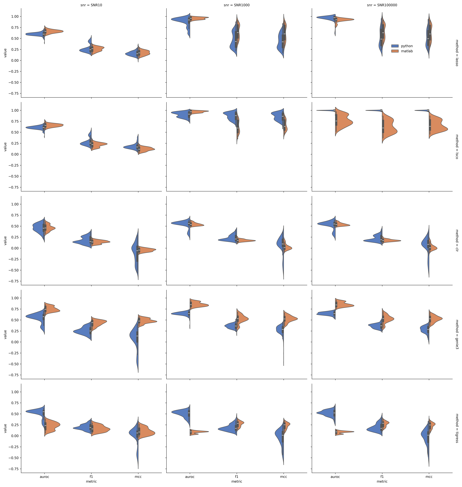

# Network Bootstrap FDR & mini GeneSPIDER

A comprehensive Python implementation of NB-FDR (Network Bootstrap False Discovery Rate) analysis for gene regulatory network inference and evaluation. This package implements an algorithm to estimate bootstrap support for network links by comparing measured networks against a shuffled (null) dataset.

## 🚀 Supported Methods

This package includes implementations of the following network inference methods:

1. **LASSO** (Least Absolute Shrinkage and Selection Operator)
2. **LSCO** (Least Squares with Cut-Off)
3. **CLR** (Context Likelihood of Relatedness)
4. **GENIE3** (GEne Network Inference with Ensemble of trees)
5. **TIGRESS** (Trustful Inference of Gene REgulation with Stability Selection)

## 📦 Installation

### Quick Start with uv (Recommended)
```bash
# Navigate to project directory
cd /path/to/pyNB

# For development with all features
uv pip install -e ".[dev,workflow]"
```

### Alternative Installation
```bash
python -m venv venv
source venv/bin/activate           # Windows: venv\Scripts\activate  
pip install -e ".[dev]"            # Core functionality + testing
pip install -e ".[workflow]"       # + Snakemake & SCENIC+ integration
```

## 🏃 Running the Benchmark

To run the benchmark across a directory of datasets and networks, use the `generate_python_results.py` script. This script automatically matches datasets to their corresponding ground-truth networks.

```bash
python generate_python_results.py \
    --dataset-dir ~/Downloads/gs-datasets \
    --network-dir ~/Downloads/gs-networks \
    --output-dir benchmark_results \
    --methods LASSO LSCO CLR GENIE3 TIGRESS
```

### Arguments
- `--dataset-dir`: Directory containing dataset JSON files.
- `--network-dir`: Directory containing network JSON files.
- `--output-dir`: Directory to save results (default: `benchmark_results`).
- `--methods`: List of methods to run (default: all 5).
- `--nestboot`: Enable NestBoot analysis (optional).

## ⚡ Quick Start: Basic Inference

Here is a simple example of how to load a dataset and run basic inference using LASSO.

```python
import sys
sys.path.insert(0, 'src')  # Ensure src is in path

from analyze.Data import Data
from datastruct.Network import Network
from methods.lasso import Lasso
import numpy as np

# 1. Load dataset from URL or file
print("📥 Loading dataset...")
dataset = Data.from_json_url(
    'https://bitbucket.org/sonnhammergrni/gs-datasets/raw/d2047430263f5ffe473525c74b4318f723c23b0e/N50/Tjarnberg-ID252384-D20151111-N50-E150-SNR10-IDY252384.json'
)

# 2. Run Network Inference (LASSO)
print("🧪 Running LASSO inference...")
lasso_net, alpha = Lasso(dataset.data)
lasso_net = Network(lasso_net)

print(f"✅ Inference complete (α={alpha:.6f})")
print(f"🕸️ Inferred edges: {np.sum(lasso_net.A != 0)}")
```

## 📊 Benchmark Results Visualization

After running the benchmark, you can generate comprehensive performance comparison plots using the included visualization scripts.

### Generate Performance Plots

```bash
# Generate split violin plots comparing Python vs MATLAB for each method
python generate_performance_report.py

# Generate box plots grouped by SNR levels
python generate_box_plots.py
```

### Sample Results

Here are example performance comparison plots for the 5 supported methods (N50 networks):




Each plot shows F1 Score, MCC, and AUROC comparisons across different SNR levels, providing a comprehensive view of method performance and stability.


### BENCHMARK CODE
The benchmark and plotting scripts are located in the [benchmark](benchmark/demo_code/n50_benchmark.ipynb). You can customize and extend these scripts to suit your analysis needs.
